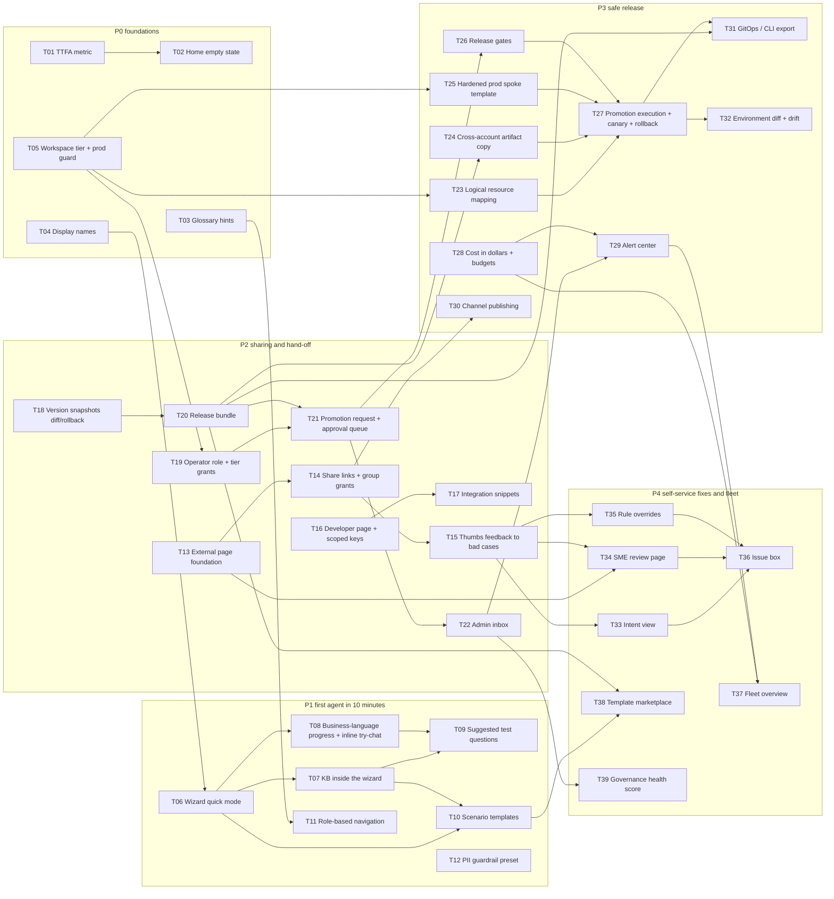

# Roadmap delivery process

This page is the working agreement for delivering the 2026-Q4 → 2027-Q3 roadmap
(brainstorm source: `_bmad-output/brainstorming/brainstorm-launchpad-roadmap-ux-2026-09-30/`).
It says **how** a roadmap task is built, verified and accepted; the task list and
its dependency DAG are below.

## 1. Branch and environment

- All roadmap work lands on the `feat/roadmap` branch, developed in a separate git
  worktree so an operator's running `--reload` stack on the primary checkout is
  never hot-reloaded mid-edit.
- End-to-end runs use a **throwaway stack** from the worktree (runbook §2): backend
  `:8011` without `--reload`, frontend `:5199` with `LAUNCHPAD_API` pointed at it,
  and a **separate ledger** (`LAUNCHPAD_DATABASE_URL=sqlite:///…/data/e2e-roadmap.db`)
  so `resume_pending_jobs()` can never replay another stack's jobs.
- AWS is real. An e2e script deletes **only** resources it created (unique
  `rm-e2e-*` names), and refuses to run against a workspace whose tier is `prod`.

## 2. Definition of done — per task

A task is done when every applicable box holds:

1. **Backend** — ledger columns added through `app/core/db.py` `_migrate*`
   (additive `ALTER TABLE … ADD COLUMN`, never destructive); every new route
   classified in `app/core/route_policy.py`; errors are `AppError` codes; boto3
   only through `app/services/aws_clients.py`.
2. **Hermetic tests** in `backend/tests/` for the new behaviour, AWS stubbed.
3. **Frontend** — `src/lib/api.ts` types match the FastAPI schemas; new
   sub-surfaces use `?view=`; every string is an i18n key with en + zh-CN parity
   and zh-CN full-width punctuation.
4. **Docs** — the feature's section in `docs/architecture.md` (English).
5. **Gate** — `make verify` green on the worktree.
6. **E2E** — covered by the phase's `backend/scripts/e2e_roadmap_p<N>.py`, run
   against the throwaway stack on real AWS, plus a browser pass of the new UI.

A phase is accepted when all its tasks are done and its e2e script passes end to
end twice in a row (the second run proves idempotent cleanup).

Two standing constraints apply to every task:

- **Console V2 only.** The classic (V1) console is being retired, so new UI is built
  as native V2 pages under `/v2/*` and in-product links point at V2 routes. A V2→V1
  hand-off that predates the roadmap is listed in §4 rather than silently relied on.
- **Security scan before push.** `make verify` and the e2e runs are necessary but not
  sufficient: the branch diff gets a final security review (the `security-review`
  pass) as the last gate before anything is pushed, and its findings are fixed or
  reported first.

## 4. Known V2 → V1 dependencies (pre-existing)

These predate the roadmap and break when the classic console is removed. Each needs a
native V2 surface before V1 goes:

| V2 entry point | Classic target | Native V2 equivalent |
|---|---|---|
| Agents list "Import", wizard "Import" | `/agents/import` | none yet |
| Wizard "System presets", Assistant page | `/agents/new` (preset panel) | none yet |
| Wizard "Open Strands Studio canvas" | `/create/studio` | none yet (vendored Studio canvas) |

## 3. Phases and dependency DAG

Critical path: T05 → T19 → T21 → T26 → T27 (with T18 → T20 joining at T21).

The per-task acceptance criteria live in the brainstorm's `roadmap-todo.md`; each
phase section of `docs/architecture.md` records what was actually built.
